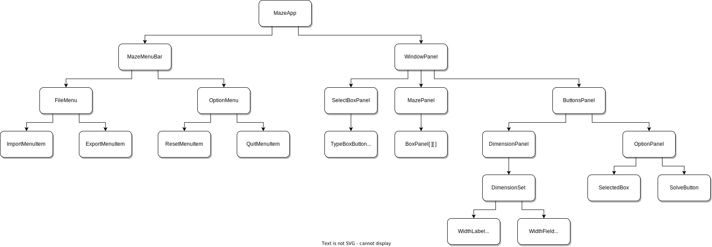

# Projet INF103 de Tristan PERROT
Développement de l'algorithme de Dijkstra et de son interface graphique pour résoudre des labyrinthes.

## Structure

### [`data`](./data)

Dans ce package est présent toute la data importée pour l'algorithme ou exportée (textes, images, etc...) pour

### [`src`](./src)

Dans ce package est présent tout le code de l'algorithme est java.

### [`algo`](./src/algo)

Dans ce package est présent la partie backend de la programmation de l'algorithme.

### [`uiProject`](./src/uiProject)

Dans ce package est présent le code de l'interface graphique de l'algorithme.

### [`projectLauncher`](./src/projectLauncher)

Dans ce package se situent les fichiers java à exécuter pour lancer l'algorithme.

### [`uiTest`](./src/uiTest)

Dans ce package se situe l'interface graphique vue en cours comme exemple. **Ce package n'est pas à prendre en compte pour la résolution des labyrinthes**

## Diagramme de l'interface utilisateur

